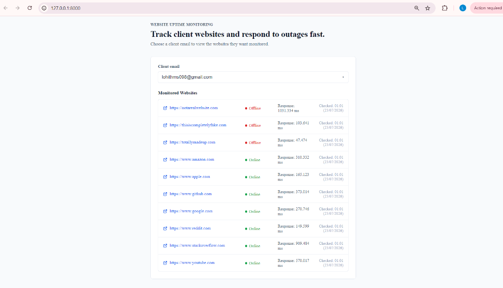
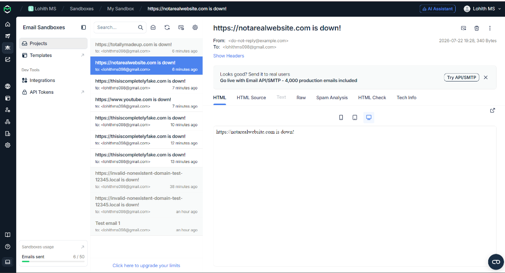

# Website Monitoring System

A simple real-time website monitoring system built with Laravel and Vue 3.

## Preview

### Client Dashboard UI
A clean, minimal serif interface allowing users to select client emails and view real-time monitored website latency, status tags, and last checked timestamps:



### Email Notifications
Automatically captures website down events and sends alerts to the configured client:



## Features
- Manually configure clients and their target websites.
- Checks website uptime every 15 minutes.
- If a website is down (returns error/timeout > 10s), alerts the client via email.
- Dashboard with dropdown selection of clients and clickable website links with safety confirm dialog.

## How to run
1. Clone the project.
2. Run `composer install` and `npm install` inside the `backend` folder.
3. Set up your `.env` with SQLite database and SMTP settings.
4. Run migrations and seeders:
   ```bash
   php artisan migrate --seed
   ```
5. Build the assets:
   ```bash
   npm run build
   ```
6. Start the server:
   ```bash
   composer run dev
   ```

## Cron Setup
To run the monitoring process in the background on Windows, open PowerShell as administrator and run:
```powershell
powershell -ExecutionPolicy Bypass -File setup-scheduler.ps1
```
